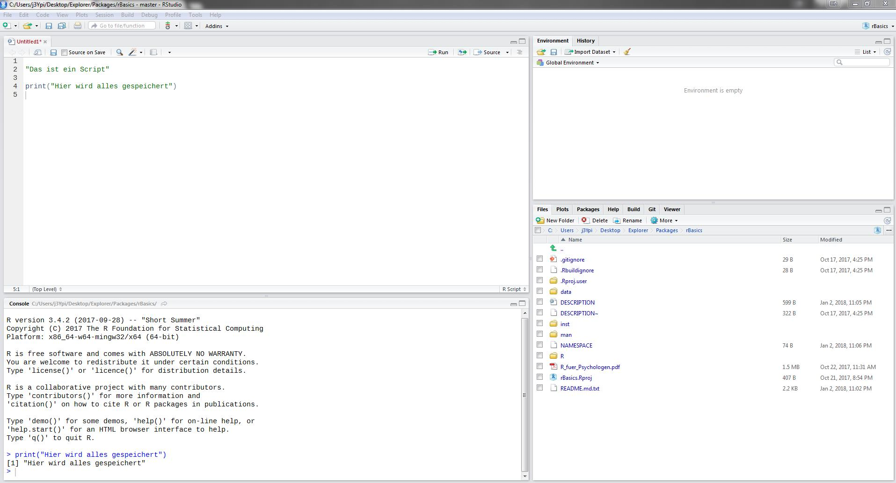

```{r setup, echo = FALSE}
suppressPackageStartupMessages(library(bookdown))
options(width = 80)
```

\newpage

# Für wen ist dieses Tutorial? 
Dieses Tutorial setzt keine Vorkenntnisse in R voraus. Somit ist es für jeden geeignet, der R lernen möchte. Aber auch jene, die bereits Vorkenntnisse mit Base R haben und in die Weiten des `tidyverse` aufbrechen wollen, kommen auf ihre Kosten. Dabei wird ein besonderer Fokus auf Probleme gelegt, mit denen empirische Wissenschaftler konfrontiert werden. 

# Aufbau
Das Tutorial ist in 6 Teile gegliedert, die sich in ihrem Umfang unterscheiden. 

1. **Setup** (Installieren von R und RStudio, wichtige Anpassungen von RStudio, Packages, R updaten, wo bekomme ich Hilfe?, Datensätze laden)
2. **Datenvorbereitung** (Projektorientierung, Import/Export, Zuweisungspfeil, Datentypen, Ansatz und Funktionen des `tidyverse`, Fehler- und Warnmeldungen, Übungen)
3. **Deskriptive Statistik** (deskriptive Maße, Umgang mit fehlenden Werten)
4. **Visualisierungen** (Säulendiagramm, Streudiagramm, Boxplot, Histogramm, Liniendiagramm (mit ANOVA Plot), speichern)
5. **Inferenzstatistik** (Stichprobenplanung und Power, Voraussetzungen prüfen, Mittelwertsvergleich, Regressionsanalyse, p-Wert Korrektur, Varianzanalysen, Post-Hoc-Tests, Korrelationskoeffizienten, Kontigenztafeln, explorative Faktorenanalyse)
6. **Extras** (Datenstrukturen [Unterschiede, Zugriff, Umwandlung], funktionales Programmieren [Funktionen erstellen, Mappen, Nesten], Transformation einer Ergebnismatrix)

Nach dem Setup hast Du bereits eine voll funktionsfähige Arbeitsumgebung und bist bereit mit R durchzustarten. Das zweite Kapitel ist der mit Abstand wichtigste Abschnitt. Jeder, der schon mehrfach mit Daten gearbeitet hat, weiß, dass die Datenvorbereitung dabei die meiste Zeit in Anspruch nimmt. Das spätere Auswerten und das Zeichnen von Graphen funktioniert immer mit wenigen kurzen Befehlen, die demselben Schema folgen. Dich auf alle Gefahren und Hürden eines unsauberen, unstrukturierten Datensatzes vorzubereiten ist Ziel von Teil 2. Da dies der umfangreichste und auch schwierigste Abschnitt ist, werden Dir zwei Übungsblöcke in einer interaktiven Lernumgebung zur Verfügung gestellt. Diese verlangen von Dir das Anwenden des gelernten auf zwei andere Datensätze (Transfer!). Teil 3 bringt dir die wichtigsten deskriptiven Maße und den Umgang mit fehlenden Werten bei. In Teil 4 lernst Du Funktionen kennen und Graphiken zu zeichnen, die Excel Anwender vor Neid erblassen lassen. Der 5. Teil beschäftigt sich mit induktiver Statistik. Der letzte Teil dient zum einen als Ausblick auf die großartigen Dinge, die ein fortgeschrittener R Nutzer programmieren kann und zum anderen werden einige grundlegende Konzepte in R wie Datenstrukturen genauer erläutert. Es wird empfohlen, die Reihenfolge beim Bearbeiten einzuhalten. Auch wenn Du R bereits installiert hast, solltest Du Dir das Setup durchlesen.

Falls Probleme auftreten oder Dir im Laufe des Tutorials etwas auffällt, was unklar formuliert ist oder gar fehlt, ist es erwünscht, auf [Github](https://github.com/j3ypi/rBasics/issues) eine neue `Issue` zu eröffnen.

Programmieren lernen ist anders als Fremdsprachen lernen. Man lernt nicht zuerst alle Vokabeln und die Grammatik auswendig. Viel mehr lernt man nur die Grammatik in Form von grundlegenden Regeln und die wichtigsten Vokabeln. Alles andere schlägt man anwendungsbezogen immer wieder nach, bis man es auswendig kann. Es ist also keine Schmach für jede aufkommende Frage während der Übungen oder bei eigenen Projekten das Tutorial zur Hilfe zu verwenden. Im Gegenteil! Wichtig ist nur, dass man genau weiß, an welcher Stelle man suchen muss. Viel Spaß!

# Set up your lab 
Bevor wir loslegen können, müssen wir erst einmal alles Notwendige installieren. Dabei muss zwischen der eigentlichen Programmiersprache namens R und der Programmierumgebung RStudio, in der Du in der gesamten Zeit arbeiten wirst, unterschieden werden. 

## Programmiersprache R 

Das Tutorial benötigt mindestens die R Version `3.3.3`. Falls R bereits auf Deinem Laptop ist, stelle sicher, dass Du keine ältere Version installiert hast. 

**Windows**:

- Gehe auf [CRAN](https://cran.uni-muenster.de/) und wähle `Download R for Windows` 
- Klick auf den Link `base` 
- Dann auf `Download R for Windows`
- Und folge schließlich den Installationsanweisungen

**macOS**:

- Gehe auf [CRAN](https://cran.uni-muenster.de/) und wähle `Download R for (Mac) OS X`.
- Klicke anschließend auf das aktuellste `.pkg` (z.B. `R-3.5.1.pkg`). Falls Du eine ältere macOS Version als El Capitan (10.11) besitzt, musst Du `R-3.3.3.pkg` herunterladen. Wenn Du Deine macOS Version nicht kennst, kannst Du erst einmal das neueste ausprobieren. R wird Dir dann mitteilen, ob Dein Betriebssystem zu alt ist. 
- Folge den Installationsanweisungen
- Drücke `cmd + Leertaste`, tippe `Terminal` ein und drücke auf `Enter`.
- Kopiere folgenden Befehl in den Terminal und drücke erneut auf `Enter` (Der Befehl ist zu lang, um im PDF vollständig angezeigt zu werden. Klicke [hier](https://j3ypi.github.io/rBasics/articles/01_Setup.html#set-up-your-lab), um zur Website zu gelangen). 
```{ruby, eval=FALSE}
ruby -e "$(curl -fsSL https://raw.githubusercontent.com/Homebrew/install/master/install)" < /dev/null 2> /dev/null
```
- Gib Dein Passwort ein (das Passwort zum Einloggen in Deinen Mac) und drücke auf `Enter`. Lass Dich nicht davon irritieren, dass im Terminal keine Zeichen bei der Passworteingabe angezeigt werden. Die Installation kann einige Minuten in Anspruch nehmen und ist erst fertig, wenn wieder die Anfangszeile mit Deinem Benutzernamen angezeigt wird (z.B. `mein-Mac:~ alice$`). 
- Zuletzt kopiere den Befehl in den Terminal. Die Installation wird noch einige Minuten dauern. Also sei geduldig und unterbreche den Vorgang nicht. 
```{bash, eval=FALSE}
brew install openssl libgit2
```

**Ubuntu**:

- Drücke `ctrl + alt + t` um den Terminal zu öffnen.
- Führe folgenden Befehl aus, um `sources.list` zu öffnen.
```{bash, eval=FALSE}
sudo gedit /etc/apt/sources.list
```
- Kopiere nun das Repository in `sources.list`. Für 16.04 benutze
```{bash, eval=FALSE}
deb https://cloud.r-project.org/bin/linux/ubuntu xenial-cran35/
```
(Für andere Versionen `xenial` zu beispielsweise `bionic` oder `trusty` ändern.)

- Führe anschließend die drei Zeilen hintereinander im Terminal aus. 
```{bash, eval = FALSE}
sudo apt-get update
sudo apt-get install r-base r-base-dev libssl-dev 
sudo apt-get install libgit2-dev libcurl4-openssl-dev libxml2-dev
```

## Programmierumgebung RStudio
R ist die Programmiersprache. Um komfortable mit einer Programmiersprache arbeiten zu können, braucht man allerdings auch eine *Umgebung* (auch IDE = Integrated Development Environment) genannt. Ohne ist programmieren oft mühsam. Eine Programmierumgebung für R heißt RStudio. Wenn R installiert ist, kann man unter folgendem [Link](https://www.rstudio.com/products/rstudio/download/) die Programmierumgebung RStudio herunterladen. Drücke dazu auf den Download Button für RStudio Desktop (Open Source License) und downloade die für dein Betriebssystem richtige Version. 

### Aufbau von RStudio
Die Oberfläche von RStudio ist in vier Teile unterteilt (siehe Abbildung 1). Unten links befindet sich die Konsole. Dort kannst du eine Zeile Code nur einmalig ausführen. Wenn man später erneut den selben Befehl ausführen möchte, muss man ihn neu eingeben. Oben links befindet sich das so genannte Script. Du kannst mehrere Scripts gleichzeitig geöffnet haben. Der große Unterschied zur Konsole ist das Speichern jeder Zeile deines Codes, sodass Du später lediglich erneut das Script ausführen musst, um genau dieselben Ergebnisse erneut zu erhalten. Der vom Script erzeugte Output wird in der Konsole angezeigt. Man kann zwischen Script und Konsole mit `strg (cmd) + 1 / 2` wechseln. Um ein neues Script zu öffnen, drücke `strg (cmd) + shift + N`. Zum Ausführen drücke in der jeweiligen Zeile `strg (cmd) + enter`. Falls alles ausgeführt werden soll, drücke zuerst `strg (cmd) + A` und führe es dann aus. Gespeichert wird mit `strg (cmd) + S`. Oben rechts befindet sich die `Environment`. In dieser kannst Du sämtliche Datensätze und Variablen betrachten, die du erstellt hast. Unten rechts sind verschiedene Reiter abgebildet. Die wichtigsten für Dich sind `Plots` und `Help`. In `Plots` werden Dir wenig überraschend die erstellten Graphen und unter `Help` die Hilfen angezeigt. Wie letztere aufgerufen werden, wird unter [Wo bekomme ich Hilfe?][Wo bekomme ich Hilfe?] erklärt.


\newpage

### Never save your workspace
Um zu gewährleisten, dass Dein Code nicht nur auf Deinem Laptop funktioniert, ist es dringend notwendig das ständige Speichern des Workspaces auszustellen.

1. Gehe zu: `Tools/Global Options.../General`
2. Entferne den Haken bei: `Restore .RData into workspace at startup`
3. Ändere `Save workspace to .RData on exit` zu `never`

Keine Sorge, auf das Speichern Deines Codes hat das keine Auswirkung.

### Default text encoding
Damit man den geschriebenen Code fehlerfrei auf anderen Geräten lesen kann, ist es wichtig, dieselbe Zeichencodierung zu wählen. Die modernste ist UTF-8. 

1. Gehe zu: `Tools/Global Options.../Code/Saving` 
2. Ändere: `Default text encoding` zu `UTF-8`

### Optionale weitere Anpassungen
Es empfielt sich, noch weitere Anpassungen vorzunehmen, die einem das Leben mit und das Lernen von R erleichtern. 

1. Gehe zu: `Tools/Global Options.../General`
2. Mache einen Haken bei: `Restore most recently openend project at startup` und `Restore previously open source documents at startup` (man braucht nur noch auf das RStudio Symbol klicken und nicht jedes mal suchen, wo die Datei auf dem Computer liegt)
3. Entferne den Haken bei: `Always save history` (History macht nur Sinn, wenn man ausschließlich mit der Konsole arbeitet)
4. Wechsel zu `Code/Display` und mache einen Haken bei `Highlight R function calls` (zum besseren Verständnis darüber, was Funktionen sind)
5. Wechsel zu `Code/Diagnostics` und mache einen Haken bei `Provide R style diagnostics` (zum angemessenen Verwenden von Leerzeichen)
6. Wechsel zu `Code/Completion` und ändere im Abschnitt `Completion Delay` die Zahlen auf 1 (character) und 0 (ms) (für schnellere Vorschläge von Funktionen)

Geschmackssache:

7. Um die Farbe von RStudio zum Beispiel in ein schickes Dunkelblau oder Schwarz zu ändern, gehe zu `Appearance` und wähle ein anderes `Editor theme`.
8. Ändere die Anordnung von Script, Konsole und dem Rest unter `Pane Layout`.

# Was ist ein Package?
R bietet von Beginn an eine Bandbreite von Funktionen. Da es R bereits seit vielen Jahren gibt, haben sich viele fähige Programmierer an die Arbeit gemacht, Funktionen zu schreiben, die die Funktionen von `Base R` erweitern. Packages sind kostenlose Erweiterungen von Dritten, die verschiedenste Aufgaben erheblich erleichtern können. Die Packages werden auf [CRAN](https://cran.r-project.org/web/packages/), auf [Github](https://github.com/) oder auf [Bioconductor](https://www.bioconductor.org/) geteilt. Es gibt mittlerweile mehr als 11 000 Packages alleine auf CRAN. 

## Packages installieren und laden
Um ein Package zu installieren, muss man `install.packages()` ausführen. Wichtig ist hierbei, dass der Packagename in Anführungszeichen geschrieben ist. Das Argument `dependencies = TRUE` installiert hierbei zusätzlich alle Packages, auf denen das gewünschte Package zugreift. 
```{r eval = FALSE}
install.packages("packageName", dependencies = TRUE)
```

Damit man auf die Funktionen des Packages zurückgreifen kann, muss das Package jedes mal aus der Bibliothek mithilfe von `library()` geladen werden. Hierbei sind keine Anführungszeichen notwendig. 
```{r, eval=FALSE}
library(packageName)
```

## Installieren der notwendigen Packages
Zuerst installieren wir mit dem Befehl alle notwendigen Packages auf Deinem Computer. Wofür jedes einzelnen davon zuständig ist, wirst du im Verlaufe des Tutorials erfahren. Die Installation kann einige Minuten in Anspruch nehmen. 
```{r, eval = FALSE}
install.packages(c("tidyverse", "here", "rio", "broom", "car", 
                   "skimr", "ggpubr", "sjstats", "devtools", 
                   "learnr", "psych", "lmerTest", "pwr", 
                   "effsize"), dependencies = TRUE)
```

Um auf die Übungsdatensätze und das interaktive Tutorial zugreifen zu können, musst Du das Package `rBasics` installieren. Allerdings befindet es sich nicht auf CRAN sondern Github. Der Befehl lautet daher etwas anders. Während der Installation des Packages kann es sein, dass Du gefragt wirst, ob Du bestimmte Packages aktualisieren möchtest. Du musst dies auf jeden Fall verneinen. Wenn ein Package angegeben ist, einfach ohne Eingabe von irgendwas die leere Zeile in der Konsole mit `Enter` bestätigen. Falls mehr als ein Package zur Aktualisierung vorgeschlagen wird, wähle die entsprechende Nummer, die für **none** steht (meistens 5) und bestätige mit `Enter`. 
```{r, eval = FALSE}
devtools::install_github("j3ypi/rBasics")
```

Sollten bei der Installation von `rBasics` Fehler auftreten, liegt das bei macOS und Linux aller Wahrscheinlichkeit nach an einer fehlerhaften Installation des `devtools` Packages, welches wiederum auf externe Softwarepakete wie `openssl` zurückgreift. Führe noch einmal kleinschrittig die [Installationsanleitung](https://j3ypi.github.io/rBasics/articles/01_Setup.html#programmiersprache-r) für Dein Betriebssystem aus. Falls es nicht funktionieren sollte, schreibe eine [Issue](https://github.com/j3ypi/rBasics/issues) auf Github. 

# Update R zur neuesten Version
Für Windows und natürlich sowieso für Linux gibt es jeweils eine einfache Möglichkeit die Version von R auf den neuesten Stand zu bringen. Für Windows brauchen wir dafür das Package `installr` (muss noch installiert werden). Allerdings ist es empfehlenswert den Updateprozess innerhalb der RGui (also dem puren R) und nicht von RStudio zu starten. Laden wir zuerst das Package.
```{r, eval=FALSE}
library(installr)
```

Anschließend updaten wir R mit nur einem Befehl. Während der Installation wird man unter anderem gefragt, ob man seine Packages mit in die neue Version nehmen will - unbedingt zustimmen!
```{r, eval=FALSE}
updateR()
```

Alternativ kann man natürlich auch einfach manuell die neueste Version von [CRAN](https://cran.uni-muenster.de/) herunterladen und installieren. In Linux updatest Du R wie jedes andere Programm mit
```{bash, eval=FALSE}
sudo apt-get update && sudo apt-get upgrade
```

# Wo bekomme ich Hilfe?
Was erst einmal nach Werbung für eine Selbsthilfegruppe in der U-Bahn klingt, ist das wohl stärkste Argument für Programmiersprachen im Gegensatz zu Programmen wie SPSS - die **Community**! Das schöne an Programmiersprachen ist, dass in der Regel irgendjemand schon einmal genau dasselbe Problem gehabt hat, wie man selbst. Wenn man nach einer Fehlermeldung oder spezifischen Frage im Internet sucht, ist meist der erste Vorschlag das Forum [Stackoverflow](https://stackoverflow.com/). Sollte noch niemand genau das selbe Problem gehabt haben, kann man auf Stackoverflow auch selbst eine Frage stellen. Die extrem zuvorkommende Community antwortet erfahrungsgemäß innerhalb von wenigen Stunden. Häufig hat man aber auch bereits nach rund zehn Minuten eine Antwort von einem der fünf Millionen aktiven Forenmitgliedern. Außerdem gibt es für jedes Package und jede Funktion eine Dokumentation auf [CRAN](https://cran.r-project.org/web/packages/available_packages_by_name.html). Diese kann man entweder mit `F1` bei Öffnen der Funktion, per `?funktionsName` (z.B. ?mean) oder über die PDF Dokumentationen im Internet aufrufen. 

# Datensätze laden
Du möchtest das Gelernte sofort selbst anwenden und ausprobieren? Lade die Datensätze mit `data()` einfach aus dem Package zum Tutorial.
```{r, eval=FALSE}
data(big_five, tipp_wm, tipp_wm_wide, 
     indonesisch, repeated, package = "rBasics")
```


