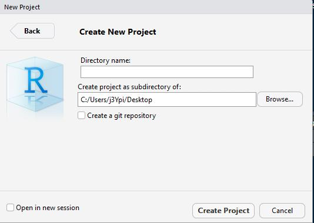

```{r setup, echo = FALSE}
suppressPackageStartupMessages(library(tidyverse))
suppressPackageStartupMessages(library(here))
suppressPackageStartupMessages(library(rio))
suppressPackageStartupMessages(library(knitr))

data(big_five, tipp_wm, tipp_wm_wide, indonesisch, repeated, package = "rBasics")
```

\newpage

# Einführung
Die Methoden zur Datenvorbereitung zu lernen, ist der mit Abstand wichtigste und schwierigste Schritt auf dem Weg, R in der Praxis anwenden zu können. Deswegen ist dieser Teil auch der umfangreichste und mit einer interaktiven Übung am Ende versehen, an der Du Dein Wissen festigen kannst. Allerdings liegt in der Datenvorbereitung auch die größte Stärke im Vergleich zu Programmen wie SPSS. Bevor wir mit der [Datenvorbereitung][Datenvorbereitung] beginnen, müssen wir uns jedoch noch verschiedene Themen aneignen.

# Projektorientierter Workflow
Projekte sind ein modernes Konzept, um R Scripte und Datensätze zu organisieren. Es gibt verschiedene Vorteile durch Projekte. Man kann zwischen Projekten innerhalb von R oben rechts einfach wechseln, der Ort von Datensätzen muss nicht mehr in Abhängigkeit vom eigenen Computer angepasst werden und Projekte sind aufgrund von in sich abgeschlossenen Umgebungen replizierbar. Aber wie erstellt man ein Projekt?

1. Oben rechts befindet sich ein Reiter namens `Project: (None)`. Klicke auf den Reiter und klicke auf `New Project...` . In dem Reiter kann man auch schon bestehende Projekte sehen. Bei Klick auf die Projekte wird das Projekt sofort mit allen zuvor geöffneten R Scripten geöffnet. Ganz ohne suchen des Ordners auf Deinem Computer. 
```{r, echo=FALSE, fig.align='center', out.width='35%'}
include_graphics("images/rproj1.jpg")
```


2. Nun sehen wir drei Möglichkeiten. Wir entscheiden uns exemplarisch für `New Directory`, was einen neuen Ordner mit einer Projektdatei erstellen wird. 
```{r, echo=FALSE, fig.align='center', out.width='50%'}
include_graphics("images/rproj2.jpg")
```

3. Bevor die Projektdatei erstellt wird, müsenn wir noch spezifizieren, welchen Projektyp wir haben möchten. Hier wählen wir `New Project`.
```{r, echo=FALSE, fig.align='center', out.width='50%'}
include_graphics("images/rproj3.jpg")
```
4. Nun müssen wir noch den Namen des neuen Ordners festlegen und angeben, wo auf dem Computer der Ordner erstellt werden soll. In Zukunft kann der Ordner nach belieben verschoben werden. Das wichtige ist die nun in diesem Ordner enthaltene Projektdatei (`projektname.rproj`).
```{r, echo=FALSE, fig.align='center', out.width='50%'}

```

Wenn Du nun das Package `here` lädst, findet das Package sofort den relativen Pfad zu Deiner Projektdatei heraus. Was bedeutet das? Egal wo sich der Ordner befindet (Desktop, Downloads Ordner oder tief verschachtel in Ordnerstrukturen), `here` findet den richtigen Weg. Zu wissen, wo sich das benutze R Script auf dem Computer befindet, ist kriegsentscheidend zum Einlesen des Datensatzes. Durch die Projektdatei braucht man also nie wieder das Working Directory per Hand mit `setwd()` festzulegen. 

Der erste Schritt ist also immer das Erstellen eines R Projekts und das Laden des Packages am Anfang jedes neuen Scripts, mit dem man einen Datensatz einlesen möchte.
```{r, eval=FALSE}
library(here)
```

Aber wie kann man den Datensatz nun einlesen?

# Import/Export
Auch wenn in diesem Tutorial die Datensätze bereits im Package enthalten sind, muss man in den meisten Fällen den Datensatz erst einmal einlesen. Datensätze können in verschiedenen Formaten vorliegen. Dies ist vor allem abhängig davon, mit welchen Programmen Unternehmen, Universitäten oder Kollegen arbeiten. Einige Beispiele sind:

- R (`.RData` | `.rda` | `.rds`)
- Excel (`.xlsx` | `.xls`)
- SPSS (`.sav`)
- Stata (`.dta`)
- Comma seperated values (`.csv`)
- Tab seperated values (`.tsv`)

## Einlesen eines Datensatzes
Eingelesen werden können sämtliche Dateientypen mithilfe von `import()` aus dem `rio` Package. Dabei erkennt die Funktion die Dateiendung und übernimmt hinter den Kulissen alles weitere. Damit der Datensatz als tibble (siehe Kapitel `Extras`) eingelesen wird, muss man `setclass = "tbl"` setzen. Für den Moment musst Du Dir beim `setclass` Argument noch nichts denken (aber trotzdem verwenden!).
```{r, eval=FALSE}
library(rio)
import("test.xlsx", setclass = "tbl")
```

Dabei muss sich das `test.xlsx` Excel Sheet innerhalb des selben Ordners wie die Projektdatei befinden. Der zweite Schritt ist also immer `rio` zu laden, da sonst die Funktionen nicht aufgerufen werden können.

## Einlesen multipler Datensätze
Nicht selten kommt es vor, dass man nicht nur einen, sondern gleich mehrere Datensätze einlesen möchte. Dabei werden die verschiedenen Files in einer Liste (mehr zu Listen im Kapitel `Extras`) gespeichert. `dir()` (für directory) listet alle Files innerhalb eines Ordners auf. Der [Pfeil](Zuweisungspfeil) wird später erklärt.
```{r, eval=FALSE}
files <- dir(pattern = "csv$")
```

Das `pattern` Argument ist optional. Man kann damit zum Beispiel die Dateiendung spezifizieren. Das Dollar-Zeichen am Ende stellt sicher, dass *csv* am Ende des Dateinamen steht. Zum Importieren verwenden wir hier `import_list()`.
```{r, eval=FALSE}
import_list(files, setclass = "tbl")
```

Würden die Dateien in einem Unterordner `data` liegen, könnte man mit der Funktion `here()` aus dem gleichnamigen Package den Pfad dahin spezifizieren.
```{r, eval=FALSE}
files <- dir(here("data"), pattern = "csv$")
```

Sind die Datensätze im selben Format, kann man `import_list()` das Argument `rbind` geben, sodass alle Datensätze zeilenweise zusammengebunden werden.
```{r, eval=FALSE}
import_list(here("data", files), setclass = "tbl", rbind = TRUE)
```

`import_list()` funktioniert übrigens auch auch bei Excel Workbooks, die mehrere Excel Sheets beinhalten. Dabei wird jedes Sheet in einem Listenelement gespeichert. Für den Moment sind Listen für uns allerdings nicht weiter von Bedeutung. 

## Speichern 
Auch das Speichern von Datensätzen könnte in R durch das `rio` Package intuitiver nicht sein. Anstelle von `import()` muss man lediglich `export()` benutzen. Das erste Argument der Funktion ist der Datensatzname, mit dem man innerhalb von R auf selbigen zugreift. Das zweite der gewünschte Dateienname.
```{r, eval=FALSE}
export(datensatz, "test.xlsx")
```

# Zuweisungspfeil 
Damit man den Datensatz auch speichert, muss man ihn einer Variable zuweisen. Dies macht man in R mit einem Zuweisungspfeil. Dabei wird die Variable in die lokale **Environment** gespeichert. Wichtig zu verstehen ist, dass in R nichts gespeichert wird, wenn man es nicht einer Variable zuweist. 

Variablen kann man grundsätzlich fast so benennen wie man möchte. Man darf nur nicht mit einer Zahl anfangen oder nach einem Punkt direkt eine Zahl als Namen wählen wie bei `.2VariablenName`. Auf Umlaute sollte im Zusammenhang mit Programmiersprachen ebenfalls **immer** verzichtet werden. In diesem Fall ist der Variablenname `tipp_wm`.
```{r, eval=FALSE}
tipp_wm <- import("tipp_wm.xlsx", setclass = "tbl")
```

Auch bei anderen Befehlen, die wir später kennenlernen, ist der Zuweisungspfeil zentral, um Ergebnisse zu speichern und sie später wieder zu verwenden. 

# Der tidyverse Ansatz
Das `tidyverse` ist eine Zusammenstellung mehrerer Packages, die aufeinander abgestimmt sind. Gegenüber `Base R` macht es vieles im Kontext von Datenverarbeitung erheblich einfacher. Der Großteil der Aufgaben, die wir mithilfe von `tidyverse` Packages machen werden, kann man auch mit normalen `Base R` Funktionen ausführen. Allerdings kommt man mithilfe des `tidyverse` einfacher und schneller ans Ziel, mit dem Nebeneffekt einer nachvollziehbareren Syntax. Gerade wenn man sich Monate später den eigenen Code noch einmal ansieht, lernt man den Wert von Lesbarkeit zu schätzen. Zur Lesbarkeit trägt auch die angemessene Verwendung von **Leerzeichen** bei. 

Der Hintergrund vom `tidyverse` ist es, **tidy data** zu kreieren. Man spricht von **tidy data**, wenn:

1. Jede Variable eine Spalte ist
2. Jede Beobachtung eine Zeile ist
3. Jeder Wert in einer Zelle ist

Wir halten fest: Nach dem Starten von RStudio erstellen wir ein Projekt und laden erst einmal die drei wichtigsten Packages `here`, `rio` und `tidyverse`.
```{r, eval=FALSE}
library(here)
library(rio)
library(tidyverse)
```

## Datentypen
Es gibt verschiedene Datentypen, die in den Spalten gespeichert werden. Die drei Hauptdatentypen, sind hier aufgelistet. In R werden sie etwas untypisch im Vergleich zu anderen Programmiersprachen benannt. In Klammern steht die jeweilige Abkürzung. 

* `numeric` (num / int / dbl): z.B. Alter, Gehalt 
```{r}
42
```
* `character` (chr): z.B. Herkunftsland, Allergien 
```{r}
"Hallo Welt"
```
* `logical` (lgl): TRUE, FALSE
```{r}
2 == 2
1 < 2 & 1 == 2
1 < 2 | 1 == 2
```

Logical Datentypen sind sicherlich erst einmal etwas seltsam für Programmiereinsteiger. Grundsätzlich kann eine logische Aussage immer nur `TRUE` oder `FALSE` zurückgeben. Ist ein Apfel gleich einer Banane? `FALSE`! Ist 1 kleiner als 2? `TRUE`! Bei logischen Abfragen ist es wichtig zu beachten, dass, wenn man auf Gleichheit von zwei Werten prüft, nicht ein einfaches `=`, sondern ein doppeltes `==` nötig ist. Man kann logische Aussagen auch kombinieren. Wenn beide logische Abfragen stimmen sollen, kann man ein `&` (UND) schreiben. Wenn nur einer Aussage richtig sein muss, damit der Wert `TRUE` zurückgegeben wird, muss man `|` (ODER) schreiben. Ungleichheit kann man mit `!=` abfragen. Das Konzept logischer Datentypen ist sehr wichtig für uns, also merken und damit warm werden!

# Datenvorbereitung
Wir erinnern uns, bei der Datenvorbereitung immer das `tidyverse` zu laden. Schauen wir uns zuerst einmal den ersten Datensatz an. Wer hat sich bei der Fußball Weltmeisterschafft 2018 in Russland nicht häufig über die Ergebnisse gewundert? Unseren 6 Personen in der Tipprunde in unserem Datensatz ging es nicht anders. 

Drei der Urväter der zwei großen Strömungen der modernen Statistik haben sich aus dem Grabe erhoben, um noch einmal beim Tippen richtig abzuräumen. Reverant Thomas Bayes, Jerzy Neyman und Egon Pearson stellen sich dem Expertenwissen der drei Studenten Alice, Bob und Charlie. 

Um den Datensatz ausgeben zu lassen, kannst Du einfach den Datensatznamen ausführen.
```{r}
tipp_wm
```

Wir sehen sofort, es gibt 384 Zeilen und 7 Spalten. Es werden immer nur die ersten 10 Werte angezeigt.

- Spieltag: Nummer des Spieltags. An jedem Spieltag haben 1 bis 4 Spiele statt gefunden.
- Person: Die 6 verschiedenen Tipper
- Tipp: Der abgegebene Tipp für das jeweilige Spiel
- Ergebnis: Das tatsächliche Ergebnis
- Tipp_Richtung: Tipp, ob Sieg/Niederlage oder Unentschieden ausgehend von der Heimmannschaft
- Wahre_Richtung: Tatsächliche Richtung, ob Sieg/Niederlage oder Unentschieden ausgehend von der Heimmannschaft
- Art: Art des Spiels (Gruppenphase, Achtelfinale, etc.)

(Der Datensatz ist in der Form nicht **tidy**.)

Du wirst schnell sehen, wie sehr sich die Methoden des `tidyverse` am normalen Englisch orientieren. Wenn wir zum Beispiel nur auf die Tipps von Reverent Bayes schauen möchten, können wir mit `filter()` einen einfach Filter setzen. Dabei müssen wir nur die Spalte mit der Information über die Person auswählen und mit einem doppelten Gleichheitszeichen abfragen, ob diese Herrn Bayes entspricht. 
```{r}
tipp_wm %>% 
  filter(Person == "Thomas_Bayes")
```

Wir sehen, dass nur noch 64 Spalten enthalten sind. So weit so gut, aber was ist dieses kryptische "Prozent, größer als, Prozent" ( `%>%` )? Was erst einmal nach Hacken ala Mr. Robot aussieht, bindet ganz einfach nur zwei Code Zeilen aneinander. Wir werden gleich sehen, worin der große Vorteil davon besteht. Man bezeichnet diese Zeichnenkombination als **Pipe**. Am Anfang jeder Pipe steht immer der Name des Datensatz. In unserem Fall `tipp_wm`. Ab hier weiß R für alle mit der Pipe verbunden Funktionen, welcher Datensatz gemeint ist. Deswegen müssen wir `filter()` auch nicht noch einmal extra mitteilen, in welchen Datensatz nach der Spalte `Person` gesucht werden soll.

Um dieses *Monster* zu erschaffen, muss man allerdings nicht immer % und > und % einzelnd eingeben sondern kann einfach `crtl + shift + M` auf Windows oder `cmd + shift + M` auf Mac schreiben. Shortcuts sind des Programmierers bester Freund. 

Schauen wir uns direkt das nächste Beispiel an. Wollen wir nun die häufige Aufgabe ausführen, eine neue Spalte zu erstellen, können wir dies mit `mutate()` machen. Auch hier kann man sich den Befehl gut mit der deutschen Übersetzung des Wortes als etwas verändern, merken. Wie immer steht der Datensatzname ganz oben noch vor der ersten Pipe. Wie für alle kommenden Funktionen zur Datenmanipulation muss auch hier der Datensatzname nicht extra innerhalb von `mutate()` aufgerufen werden. Das geschieht alles hinter den Kulissen. In diesem Beispiel nehmen wir willkürlich die `Spieltag` Spalte und addieren Zeilenweise eine 1 hinzu (würde uns in der Praxis natürlich nichts bringen) und nennen diese neue Spalte kreativer Weise `Neue_Spalte`. Der Name vor dem Gleichheitszeichen ist immer der Name der neuen Spalte.  
```{r}
tipp_wm %>% 
  mutate(Neue_Spalte = Spieltag + 1)
```

Möchten wir nun bestimmte Spalten auswählen, können wir das einfach mit `select()` machen. Erneut nach genau dem selben Schema. Hier wählen wir die Spalten `Spieltag`, `Person` und `Ergebnis` aus. Man kann an dieser Stelle auch Spalten umbenennen, indem man den neuen Namen einfach vor den Spaltennamen schreibt. Wir machen exemplarisch aus `Person` einfach mal `Tipper`.
```{r}
tipp_wm %>% 
  select(Spieltag, Tipper = Person, Ergebnis)
```

Manchmal möchte man aber Spalten umbennen und alle Spalten im Datensatz behalten. Wir erinnern uns, `select()` wählt nur die explizit genannten aus. Eine Lösung bietet `rename()` mit genau der gleichen Syntax, nur werden hier alle weiteren Spalten behalten.
```{r}
tipp_wm %>% 
  rename(Tipper = Person)
```

So weit so gut. Aber wozu brauchen wir nun diese kryptische Pipe? Es ist äußerst selten, dass man nur einen Befehl auf einmal anwenden möchte. Wenn wir zum Beispiel die drei gelernten Funktionen innerhalb eines Befehls kombinieren möchten, können wir diese einfach mit einer Pipe verbinden. Wir erstellen also zuerst eine neue Spalte, filtern alle Einträge von Bob heraus und schauen uns dann nur die drei Spalten `Person`, `Ergebnis` und `Neue_Spalte` an. 

```{r}
tipp_wm %>% 
  mutate(Neue_Spalte = Spieltag + 1) %>% 
  filter(Person == "Bob") %>% 
  select(Person, Ergebnis, Neue_Spalte)
```

Die Reihenfolge der Funktionsaufrufe spielt dabei eine entscheidene Rolle. Hätten wir zuerst **nur** die Spalten `Ergebnis` und `Neue_Spalte` ausgewählt, hätten wir anschließend nicht mehr nach Bob suchen können, da die Spalte `Person` gar nicht mehr im Datensatz enthalten wäre (siehe das `select()` Beispiel oben). Außerdem wäre die `Neue_Spalte` noch gar nicht existent.

Es gibt noch mehr nützliche Funktionen -- alle nach dem selben Prinzip. Möchten wir die Variablen gruppieren, um für jede der Gruppen eine bestimmte Funktion anzuwenden, verwenden wir `group_by()`. Beispielhaft zählen wir die Anzahl der Einträge jeder Person mit `count()`. Um die Reihenfolge der Personen in absteigender Reihenfolge des Alphabets anzuzeigen, können wir innerhalb von `arrange()` die `desc()` (descending, engl. absteigend) Funktion verwenden.   
```{r}
tipp_wm %>% 
  group_by(Person) %>% 
  count() %>% 
  arrange(desc(Person))
```

Hier hat jede Person gleich viele Tipps abgegeben. Zumindest befinden sich gleich viele Zeilen für jede Person im Datensatz. Aufschluss über die Anzahl der NAs kriegen wir erst später (siehe Kapitel `Deskriptive Statistik`).

Bei ANOVAs braucht man Kategorien, nach denen man die abhängige Variable untersuchen kann. Was wäre, wenn wir untersuchen möchten, ob sich die erreichten Punktzahlen -- also die Qualität der Tipps -- zwischen Gruppenphase und KO-Phase verändert haben? In der Spalte `Art` gibt es allerdings die Ausprägungen `Gruppenphase`, `Achtelfinale`, `Viertelfinale`, `Halbfinale` und `Finale`. Alle Finalarten fallen in die Kategorie KO-Phase. Was wir brauchen, ist also eine neue Spalte, die immer **wenn** `Gruppenphase` in der Spalte `Art` steht, `Gruppe` beinhaltet und **ansonsten** `KO`. Erreichen können wir dies mit dem `if_else()` (engl. für wenn_ansonsten) Befehl. Als erstes Argument muss der Funktion die Bedingung gegeben werden, die erfüllt werden soll. Diese muss immer einen logischen Datentyp zurückgeben -- also wahr oder falsch (`TRUE`, `FALSE`). Das zweite Argument ist das, was passieren soll, **wenn** die Bedingungen zutrifft. Das dritte Argument kümmert sich um alle **sonstigen** Fälle. Also **wenn** in der Spalte `Art` die `Gruppenphase` steht, trage `Gruppe` ein, ansonsten `KO`. Wir nennen diese neue Spalte `Phase`. 
```{r}
tipp_wm %>% 
  mutate(Phase = if_else(Art == "Gruppenphase", "Gruppe", "KO"))
```

```{r, echo=FALSE}
tipp_wm <- tipp_wm %>% 
  mutate(Phase = if_else(Art == "Gruppenphase", "Gruppe", "KO"))
```

Für Regressionsanalysen brauchen wir hingegen Dummy Variablen. Diese können wir auf genau dieselbe Art und Weise erstellen. Wenn die `Phase` gleich der `Gruppenphase` ist, schreibe eine 1, ansonsten eine 0. Das gleiche Prinzip gilt für die Dummy Variable von `KO`.
```{r}
tipp_wm %>% 
  mutate(Gruppe = if_else(Phase == "Gruppe", 1, 0),
         KO = if_else(Phase == "KO", 1, 0))
```

Eine `if_else` Verzweigung kann immer nur 2 Fälle abgedecken. Wenn die Bedingung wahr oder eben falsch ist. Was, wenn es mehr Fälle gibt? Angenommen, wir möchten eine Spalte mit der Punktezahl pro Spiel erstellen. Bepunkten wollen wir es in traditioneller Manier mit 3 Punkten für einen komplett richtigen Tipp, 1 Punkt für die richtige Richtung (Sieg/Niederlage/Unentschieden) und keine Punkte, wenn weder noch erraten wurde. Das sind drei Fälle. Deswegen benötigen wir nun `case_when()`. Hier können beliebig viele Bedingungen abgefragt werden. Dabei steht die logische Bedingung wieder an erster Stelle. Was bei der Wahrheit der Bedingung geschehen soll, steht hinter der Tilde `~`. Wenn der Tipp gleich dem Ergebnis ist, gibt es drei Punkte usw. Die letzte Zeile des Befehls sieht etwas komisch aus. Dabei funktioniert das `TRUE` wie das `else` im `if_else` Befehl. Es deckt alle **sonstigen** Fälle ab. 
```{r}
tipp_wm %>% 
  mutate(Punkte = case_when(Tipp == Ergebnis ~ 3,
                            Tipp_Richtung == Wahre_Richtung ~ 1,
                            TRUE ~ 0))
```

Es ist Dir sicher aufgefallen, dass wir bisher noch nie den bereits erwähnten Zuweisungspfeil `<-` verwendet haben. Das heißt, dass unsere Rechnungen in Schall und Rauch aus Einsen und Nullen verschwunden sind. Möchten wir die Ergebnisse der Pipe speichern, müsse wir die Ergebnisse einer Variable zuordnen. Wenn wir lediglich Spalten dran gehängt haben, macht es durchaus Sinn, dabei den selben Datensatznamen zu verwenden. Ansonsten ist ein anderer, aussagekräftiger Name zu empfehlen wie `tipp_wm_bayes` falls zum Beispiel nach allen Tipps von Thomas Bayes gefiltert wurde. 
```{r}
tipp_wm <- tipp_wm %>% 
  mutate(Punkte = case_when(Tipp == Ergebnis ~ 3,
                            Tipp_Richtung == Wahre_Richtung ~ 1,
                            TRUE ~ 0))
```

Wollen wir Spalten logarithmieren oder standardisieren, können wir dies mit `log()` respektive `scale()` machen. Zur Illustration behalten wir nur die Spalten der Spieltage.
```{r}
tipp_wm %>% 
  mutate(Spieltag_lg = log(Spieltag),
         Spieltag_z = scale(Spieltag)) %>% 
  select(Spieltag, Spieltag_lg, Spieltag_z)
```

Mit `mutate_at()` erhält man die Möglichkeit eine Funktion wie `log()` gleich auf mehrere Spalten anzuwenden. Dabei müssen die Spalten im `vars()` Argument verpackt werden.
```{r}
tipp_wm %>% 
  mutate_at(vars(Spieltag, Punkte), log)
```

Ein paar wichtige Konzepte fehlen uns noch. Dafür schauen wir uns einen neuen Datensatz namens `big_five` an. Der Datensatz beinhaltet soziodemographische Daten wie `Alter`, `Geschlecht` und `Herkunft` sowie Spalten für die durchschnittliche Ausprägung von `Extraversion`, `Neurotizismus`, `Verträglichkeit` und `Gewissenhaftigkeit`. Für den fünften Persönlichkeitsfaktor `Offenheit` wurde noch kein durchschnittlicher Wert berechnet. Es gibt 10 Items `O1` bis `O10`, die die Dimension der Offenheit abgefragt haben. 
```{r}
big_five
```

Somit stoßen wir auch schon auf eine sehr häufige Problemstellung. Das Berechnen von Mittelwerten oder Summen über mehrer Spalten pro Person (also zeilenweise). Dafür wählen wir uns zuerst die interessierenden Spalten wie gewohnt mit `select()` aus. Wenn die Spalten nebeneinander liegen, kann man auch einfach einen Doppelpunkt benutzen.
```{r}
vars <- big_five %>% 
  select(O1:O10)
```

Der Doppelpunkt liest sich hier zum Beispiel als O1 bis O10. Erst einmal ausgewählt, ist der Rest schnell erledigt. Wir erstellen mit `mutate()` eine neue Spalte namens `Offenheit` und erhalten mit `rowMeans()` die Mittelwerte pro Zeile (row), also pro Person. Es gibt eine äquivalente Funktion `rowSums()` zum Summieren. Anschließend möchten wir die einzelnen Items nicht im Datensatz, sondern nur die soziodemographischen Daten und die fünf Dimensionen der Persönlichkeitsfaktoren behalten.
```{r}
big_five %>% 
  mutate(Offenheit = rowMeans(vars)) %>% 
  select(Alter:Gewissenhaftigkeit, Offenheit)
```

Die Reihenfolge der in `select()` ausgewählten Spalten entscheidet übrigens über die Reihenfolge der Spalten. Alternativ zum Auswählen der Spalten, die man behalten möchte, kann man auch einfach die ungewünschten Spalten `O1` bis `O10` entfernen. 
```{r, eval=FALSE}
big_five %>% 
  mutate(Offenheit = rowMeans(vars)) %>% 
  select(-(O1:O10))
```

Beachte die Klammern um `O1:O10`. Was ist eigentlich, wenn man nur Spalten mit Zahlen im Datensatz behalten möchte? Mit `select_if()` ist eine speziell auf solche Aufgaben zugeschnittene Funktion verfügbar. **Wenn** die Spalte numerisch ist (`is.numeric`), wird sie behalten.
```{r}
big_five %>% 
  select_if(is.numeric)
```

Ein weiterer praktischer Sonderfall ist `select_at()`. Die Funktionsweise ist die selbe wie bei `mutate_at()`. Der Vorteil ist die Integration von `starts_with()` und `ends_with()` womit man, wie der Name bereits suggeriert, Anfangs- respektive Endbuchstaben oder ganze Wörter auswählen kann. Es werden also nur die Spalten behalten, die mit der Zeichenkombination starten oder enden. Hier erhalten wir alle Spalten mit dem Anfangsbuchstaben `E`. Also hier nur Extraversion. 
```{r}
big_five %>% 
  select_at(vars(starts_with("E")))
```

## Breites vs. langes Datenformat
Das lange Datenformat ist eins der wichtigsten Konzepte. Man benötigt es für jeden Graphen und für manche induktiven Verfahren. Man erhält im Großteil der Fälle beim Erheben Daten im breiten Format. Um das besser zu veranschaulichen schauen wir uns einmal an, wie unsere Tipps zur WM in breitem Format aussehen würden. 
```{r}
tipp_wm_wide
```

In jeder Spalte sind hier die Tipps der jeweiligen Person. Was bedeutet es nun, diesen Datensatz lang zu machen?
```{r}
tipp_wm_wide %>% 
  gather(Person, Tipp, Thomas_Bayes:Charlie)
```

Wie man sieht, werden nun alle Ergebnisse, Personen und Tipps jeweils in eine Spalte geschrieben. Wir erreichen dies mit `gather()`. Das erste Arugment ist der Name der neuen Spalten, die die Werte der Spaltennamen enthält. Also hier die Personen. Das zweite Argument beschreibt die Werte innerhalb der Spalten, die wir hier als `Tipp` bezeichnen. Das dritte Argument sind nun die Spalten, die zusammen gesammelt werden sollen. Wir wollen alle Personen -- also von Thomas Bayes bis Charlie -- in der Spalte `Person` haben. Weshalb wir das brauchen, wird in den folgenden Kapiteln noch klarer. Das Prinzip hinter `gather()` ist etwas abstrakt und verlangt am Anfang erst einmal Gewöhnung. Wenn man sich nicht sicher ist, welcher Name nun wozu gehört kann man gut und gerne auch erst einmal sowas wie
```{r}
tipp_wm_wide %>% 
  gather(test, test1, Thomas_Bayes:Charlie)
```

schreiben und `test` und `test1` anschließend in passende Spaltennamen ändern. Das Gegenstück zu `gather()` ist `spread()`, allerdings ist die Funktion kein perfekter Gegenspieler. Häufiger treten Fehler auf. Gut für uns, dass es praktisch nicht vorkommt, lange Formate breit machen zu wollen.

Den größten Teil hast du nun bereits hinter Dir. Bevor Du dich jedoch euphorisch auf die Übungsaufgaben stürzst, noch ein paare Worte zu Fehler- und Warnmeldungen.

# Fehler- und Warnmeldungen
Es gibt einen großen Unterschied zwischen Fehler- und Warnmeldungen. Wie der Name bereits suggeriert, stoppen Fehlermeldungen den Code, während Warnmeldungen ein Ergebnis zurückgeben und nur auf eine Ungereimtheit hinweisen. Es ist also sehr wichtig, die roten Meldungen in der Konsole genau zu lesen. Wichtig ist, beim roten Text nicht gleich in Panik zu geraten, sondern entspannt die Meldung durchzulesen und falls man nicht weiter weiß, die Meldung zu googeln. 

# Übungen 
Nun geht's an die Übung. Kopiere den R Befehl in Deine Konsole und es startet sich ein interaktives Tutorial in Deinem Standardbrowser.
```{r, eval = FALSE}
learnr::run_tutorial("wiederholung", package = "rBasics")
```
Der interaktive Übungssatz beinhaltet verschiedene Übungen, die das Verständnis des Gelernten prüfen sollen. Dabei kann man sich Hinweise holen, wenn man nicht weiterkommt. Bei Multiple Choice Fragen wird sofort geprüft, ob die Antwort korrekt ist. Um zu erfahren, ob der geschrieben Code richtig ist, kann man mehrmals auf `Hints` drücken, da der letzte Hinweis immer die Lösung beinhaltet. Der Fortschritt wird automatisch auf Deinem Computer gespeichert, sodass Du zu einem späteren Zeitpunkt die Übungen fortführen kannst. Viel Erfolg und vor allem viel Spaß!


